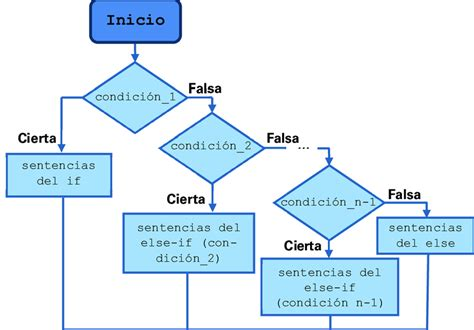
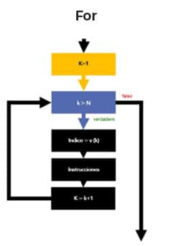
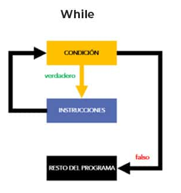

# <center>***CHECKPOINT 5*** </center> 
## **¿QUE ES UN CONDICIONAL?**[](https://docs.python.org/es/3.13/tutorial/controlflow.html#if-statements)
### 1. Un condicional es una sentencia que permite que se ejecute un bloque de codigo, en funcion de si se cumple una condicion o no.

> Una sentencia condicional solamente tiene dos resultados posibles: **Verdadero** (la sentencia se cumple) o **Falso** (la sentencia no se cumple)

### Se puede ejecutar codigo tanto si la sentencia se cumple como si no se cumple:
> - **if** *[sentencia]: [codigo]* --> Se ejecutara el codigo **si** la sentencia se cumple.
  
> - **else**: *[codigo]* --> Se ejecutara si la sentencia **no** se cumple

# 

### 2. Se puede comprobar mas de una condicion dentro de un bloque condicional, a traves de la sentencia **elif** :
> - **if** *[sentencia_1]: [codigo]* --> Se ejecutara el codigo **si** la sentencia se cumple. 
> - **elif** *[sentencia_2]: [codigo]* --> Se ejecutara el codigo **si** la segunda sentencia se cumple. 
> - **else**: *[codigo]* --> Se ejecutara el codigo si la sentencia **no** se cumple. 

### 3. Es posible hacer mas de una comprobacion dentro de una sentecia ***if***, puedes combinar varias condiciones usando los operadores logicos: **and, or, not**:
- ***and:*** Se tienen que cumplir ambas condiciones.
``` python
edad = 25
tiene_identificacion = True

if edad >= 18 and tiene_identificacion:
    print("Puedes entrar al evento.")
```
-  ***or:*** Al menos una condicion se cumple.
``` python
dia = "sábado"

if dia == "sábado" or dia == "domingo":
    print("Es fin de semana.")

````
-  ***not:*** invierte el valor de la condicion.
``` python
llueve = False

if not llueve:
    print("Puedes salir sin paraguas.")

```
### 4. Que es una sentencia If **anidada?**
Cuando **dentro** de un bloque **if**, nos encontramos con otra sentencia **if**, se trata de uma ***sentencia if anidada***, esto permite establecer varias condiciones para una mismo flujo.   
Por ejemplo, si queremos comprobar si una persona tiene la edad requeria y esta invitada a un evento:
``` python
edad = int(input("Ingrese su edad: "))
tiene_invitacion = input("¿Tienes invitación? (sí/no): ").lower()

if edad >= 18:
    if tiene_invitacion == "sí":
        print("¡Bienvenido al evento VIP!")
    else:
        print("Necesitas una invitación para entrar.")
else:
    print("Lo siento, debes ser mayor de edad para entrar.")

```
#### Puedes anidar tantas condiciones if como quieras,, pero cada una de reduce la optimización del programa y lo hace **más complejo de leer y entender**. Por lo tanto, es mejor **reducir a lo minimo necesario** el número de anidaciones.

---

## **¿Cuáles son los diferentes tipos de bucles en Python? ¿Por qué son útiles?**[](https://docs.python.org/es/3.13/tutorial/controlflow.html#for-statements)
### En Python, el **bucle for se utiliza para iterar** (repetir un proceso varias veces) **sobre** los elementos de un **objeto iterable** (como una lista, tupla, conjunto, o diccionario). Ejecuta un bloque de código una vez para cada elemento del iterable, permitiendo procesar los elementos de **forma secuencial**. 
### Los bucles son importantes ya que te ayudan a ejecutar un **bloque de código repetidamente**. 
### Existen dos tipos de bucles en python:  ***for*** y  ***while*** 
### Ambas tienen diferencias clave en la manera de funcionar y de utilizarse.
>  ***for*** :  
> - Se usa cuando podemos saber cuantas veces se va realizar el bucle o repetir la accion.  
> - Itera sobre sequencias (listas, tuplas, rangos, cadenas,etc..)
> - Es mas facil de leer y entender
> - Estructura mejor el codigo  
>  ``` python
> for i in range(5):  # Itera de 0 a 4
>      print(i)        # Muestra el numero
>   ```

# <center> </center>
### **Iterables e iteradores**
Para entender al cien por cien los **bucles for**, y como Python fue diseñado como lenguaje de programación, es muy importante entender los conceptos de iterables e iteradores. Empecemos con un par de definiciones:
•	**Los iterables son** aquellos **objetos** que como su nombre indica pueden ser iterados, lo que dicho de otra forma es, **que puedan ser indexados**.  

•	**Los iteradores son objetos que hacen referencia a un elemento**, y que **tienen un método next()** que permite hacer **referencia al siguiente**.
los iterables son objetos que pueden ser iterados o accedidos con un índice. Algunos ejemplos de iterables en Python son las listas, tuplas, cadenas o diccionarios. Sabiendo esto, lo primero que tenemos que tener claro es que en un ***for, lo que va después del *in* deberá ser siempre un iterable***  


>  ***while*** :
> - Se usa cuando no podemos saber cuantas veces se va realizar el bucle o repetir la accion.  
> - Se repite mientras se cumpla la condicion (sea verdadera)
> - Necesitan un punto de ruptura o variable centinela para que el bucle no sea infinito
>  ``` python
>contador = 0
>while contador < 5:  # Se ejecuta mientras contador sea menor que 5
>    print(contador)
>    contador += 1  # Incremento para evitar un bucle infinito
### El uso del **while** nos permite **ejecutar una sección de código repetidas veces**, de ahí su nombre. El código se ejecutará mientras una condición determinada se cumpla. Cuando se deje de cumplir, se saldrá del bucle y se continuará la ejecución normal. 
# <center> </center>
### Existe dos tipos de bucles, los que tienen un **número de iteraciones no definidas**, y los que tienen un número de iteraciones definidas. El **while** estaría dentro del primer tipo
> Un **mal** uso del **while** puede dar lugar a **bucles infinitos** y problemas. Aunque en algún caso tal vez nos interese tener un bucle infinito, pero salvo que estemos seguros de lo que estamos haciendo, hay que tener cuidado
---
## **¿Qué es una lista por comprensión en Python?**[](https://docs.python.org/es/3.13/tutorial/datastructures.html#list-comprehensions)
### Las listas por comprension son una manera concisa y eficiente que tiene python para generar listas.
### Su principal caracteristica es que se generan utilizando **solamente una linea de codigo** y no necesitan ningun bucle for para ello.
### Su sintaxis es la siguiente:
> *nueva_lista = [expresión **for** elemento **in** iterable]*
### Por un lado tenemos el **for** elemento **in** iterable, que itera un determinado iterable y “guarda” cada uno de los elementos en '**nueva_lista**'. Por otro lado, tenemos la expresión, que es lo que será añadido a la lista en cada iteración.   
``` python
numeros = [1, 2, 3, 4, 5]
cuadrados = [n**2 for n in numeros]
print(cuadrados)  # Salida: [1, 4, 9, 16, 25]

```
### La **expresión** también puede ser una **llamada a una función**. Se podría escribir el ejemplo anterior del cálculo de cuadrados de la siguiente manera.
``` python
def cuadrado(i):
    return i**2
cuadrados = [cuadrado(i) for i in range(5)]
# [0, 1, 4, 9, 16]
```
### Mejoran la **legibilidad** del codigo y su **rendimiento**.
### Un ejemplo sencillo, para generar una lista de los cuadrados de una lista de numeros, utilizando **listas por comprension**..

### El mismo ejemplo utilizando **bucle** for ..
``` python
numeros = [1, 2, 3, 4, 5]
cuadrados = []

for n in numeros:
    cuadrados.append(n**2)

print(cuadrados)  # Salida: [1, 4, 9, 16, 25]

```
### Se pueden generar listas por comprension y **modificar** sus valores en funcion de una condicion, usando condicionales (if-else):
``` python
numeros = [1, 2, 3, 4, 5]
modificados = [n**2 if n % 2 == 0 else n**3 for n in numeros]
print(modificados)  # Salida: [1, 4, 27, 16, 125]

```
### Tambien es posible **anidar un bucle** for dentro de otro bucle for (anidacion de bucles):
``` python
letras = ['A', 'B', 'C']
numeros = [1, 2, 3]
combinaciones = [(letra, numero) for letra in letras for numero in numeros]
print(combinaciones)
# Salida: [('A', 1), ('A', 2), ('A', 3), ('B', 1), ('B', 2), ('B', 3), ('C', 1), ('C', 2), ('C', 3)]
```
---

## **¿Qué es un argumento en Python?**[](https://docs.python.org/es/3.13/tutorial/controlflow.html#default-argument-values)
### Un argumento en python es un **valor**, que se le pasa a una **funcion** cuando se le **llama** desde cualquier parte de un programa.
### Hace que las funciones sean mas **flexibles** y se puedan **reutilizar** mas facilmente.
> Los argumentos en python pueden ser: ***posicionales***, con **nombre** (Key Arguments), de **longitud variable** (*args, **kwargs)

### Los argumentos posicionales:
Son los más comunes y se pasan en el orden en que aparecen en la definición de la función.
``` python
def saludar(nombre, edad):
    print(f"Hola {nombre}, tienes {edad} años.")

saludar("Israel", 25)  # Salida: Hola Israel, tienes 25 años.

```
### Los argumentos con nombre (Key Arguments):
Permiten especificar los valores de los argumentos **usando su nombre**, sin importar el orden¡¡
``` python
def saludar(nombre, edad):
    print(f"Hola {nombre}, tienes {edad} años.")

saludar(edad=22, nombre="Carlos")  # Salida: Hola Carlos, tienes 22 años.

```
> Al indicar en la llamada a la función el **nombre de la variable** y el valor, **el orden ya no importa**  
### Si indicamos un argumento que no ha sido definido como parámetro de entrada, tendremos un error, de tipo:
``` python
Unexpected keyword argument
```
### Argumentos por defecto
A veces necesitamos tener una función con algún **parámetro opcional**, que pueda ser usado o no dependiendo de diferentes **circunstancias**. Lo que podemos hacer es ***asignar un valor por defecto a la función***. En el siguiente caso ***c*** valdría cero salvo que se indique lo contrario.
``` python
def suma(a, b, c=0):
    return a+b+c
suma(5,5,3) # 13
```

### Los argumentos de **longitud variable**:*args, **kwargs
Permiten pasar un número indefinido de argumentos posicionales.
- *args:  Devuelve una tupla con los argumentos
``` python
def sumar(*numeros):
    return sum(numeros)

print(sumar(1, 2, 3, 4, 5))  # Salida: 15

```
- **kwargs: Devuelve un diccionario con los argumentos {nombre}:{valor}
``` python
def mostrar_info(**datos):
    for clave, valor in datos.items():
        print(f"{clave}: {valor}")

mostrar_info(nombre="Ana", edad=25, ciudad="Madrid")

```
### Buenas practicas con argumentos:
>1. Usar nombres **descriptivos** para los argumentos 
>2. **No** usar **demasiados argumentos** en una misma funcion
>3. Usar **valores predeterminados** siempre que se pueda
>4. Usa *args y **kwargs **solo** cuando sea **necesario**.

---
## **¿Qué es una funcion lambda?**[](https://docs.python.org/es/3.13/tutorial/controlflow.html#lambda-expressions)
### Se le llama funciones lambda a **pequeñas funciones**, sin nombre, que se escriben en **una sola linea** de codigo.
``` python
lambda argumentos: expresión
```
### Las funciones lambda son una herramienta para escribir código más conciso en Python.
> No es necesario utilizar la palabra reservada ***def*** para definirlas.  
> Permiten utilizar **multiples argumentos**. 
### Un ejemplo basico seria:
``` python
doble = lambda x: x * 2
print(doble(5))  # Salida: 10
```

### Son muy utiles para utilizar combinandose con funciones simples y temporales, como ``` map(), filter(), sorted()```
Por ejemplo: para filtrar los valores *pares* de una *lista* 
``` python
numeros = [1, 2, 3, 4, 5, 6]
pares = list(filter(lambda x: x % 2 == 0, numeros))
print(pares)  # Salida: [2, 4, 6]
```

### Una función lambda puede ser la entrada a una función normal.
``` python
def mi_funcion(lambda_func):
    return lambda_func(2,4)
mi_funcion(lambda a, b: a + b)
```
### Y una función normal también puede ser la entrada de una función lambda. 
``` python
def mi_otra_funcion(a, b):
    return a + b

(lambda a, b: mi_otra_funcion(a, b))(2, 4)
```
### Es posible tener argumentos con valor asignado por defecto.
``` python
(lambda a, b, c=3: a + b + c)(1, 2) # 6
```
### También se pueden pasar los parámetros indicando su nombre.
``` python
(lambda a, b, c: a + b + c)(a=1, b=2, c=3) # 6
```
### Al igual que en las funciones se puede tener un número variable de argumentos haciendo uso de *, lo conocido como tuple unpacking.
``` python
(lambda *args: sum(args))(1, 2, 3) # 6
```
### Y si tenemos los parámetros de entrada almacenados en forma de key y value como si fuera un diccionario, también es posible llamar a la función.
``` python
(lambda **kwargs: sum(kwargs.values()))(a=1, b=2, c=3) # 6
``` 
### **Las funciones lambda solo pueden contener expresiones, por lo que no puedes incluir ``` print, while, for, return ```, etc..**

---

## **¿Qué es un paquete pip?**[](https://docs.python.org/es/3.13/tutorial/venv.html#managing-packages-with-pip)
### **pip** es una herramienta **esencial** para cualquier **programador** de Python, ya que ayuda a llevar a cabo la gestión de paquetes y dependencias.  
>Es el **gestor** de paquetes oficial de Python!!  
>Permite:  
> - Instalar nuevas bibliotecas  
> - Actualizar paquetes existentes  
> - Desinstalar paquetes
>
Escribe en la terminal:
 ``` bash
pip --version # Para saber si tienes instalado pip y la version
``` 
### **Para instalar paquetes externos**:
``` python
pip install numpy # Instalar numpy con pip
```
### **Para instalar una version concreta de un paquete**:
``` python
pip install numpy=='1.21.2' # Instala la version 1.21.2 de numpy  
```
### **Para actualizar un paquete externo**:
``` python
pip install --upgrade numpy # Actualiza el modulo numpy
```   
### **Uso de requirements.txt**:
Es común tener un archivo ***requirements.txt*** que ofrece una lista de todos los paquetes y sus versiones necesarios para ejecutar el proyecto.  
Para instalar todos estos paquetes a la vez, ejecuta:
``` python
pip install -r requirements.txt # instalará los paquetes sus con sus versiones 
```   
---