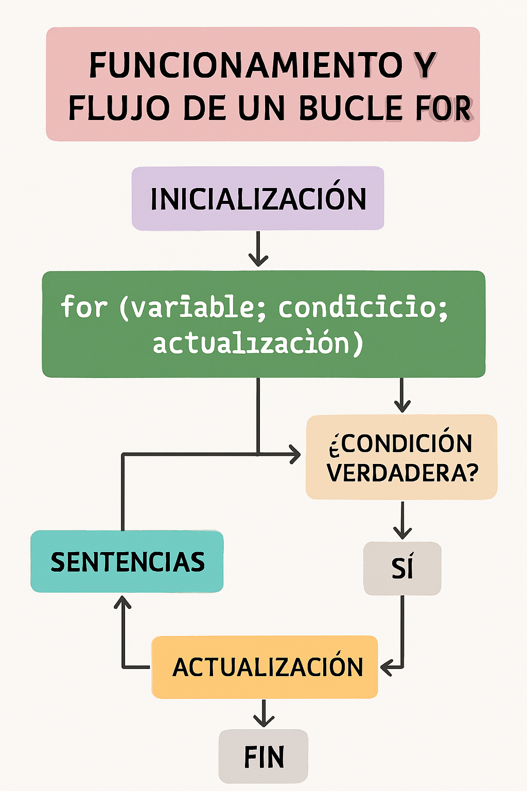
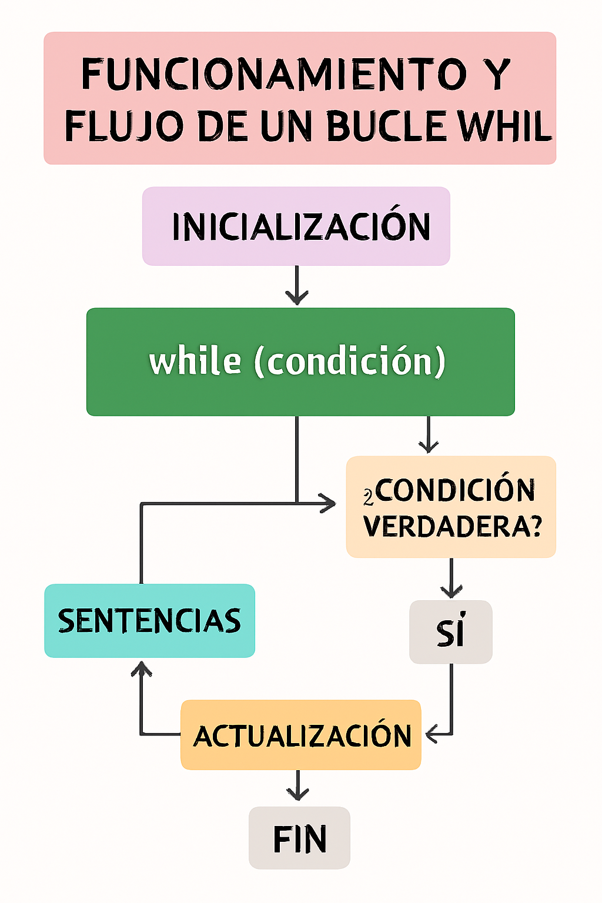
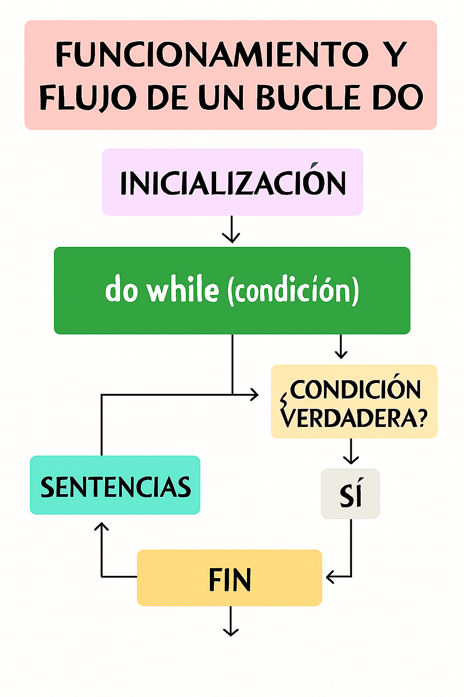
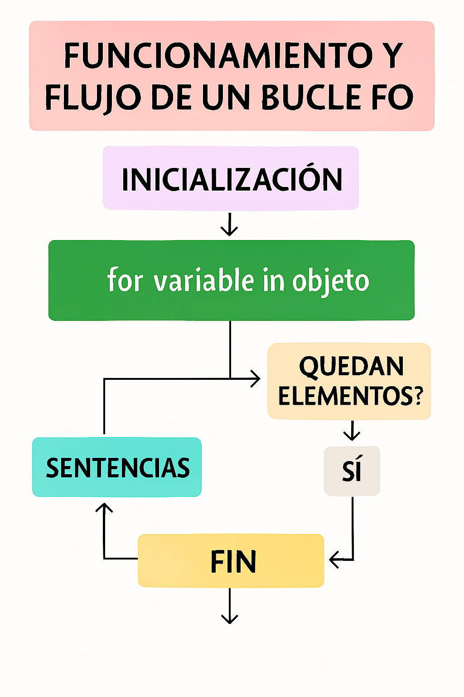
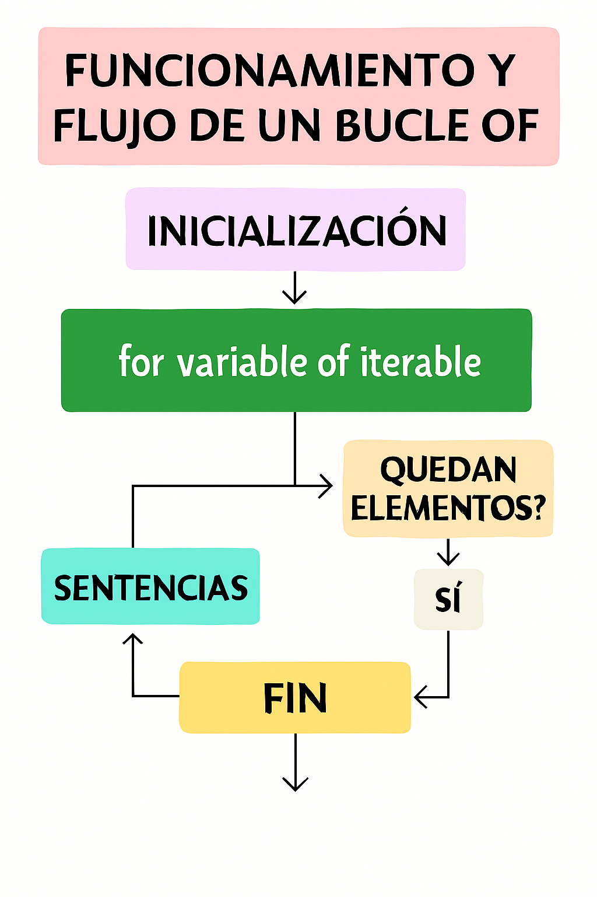
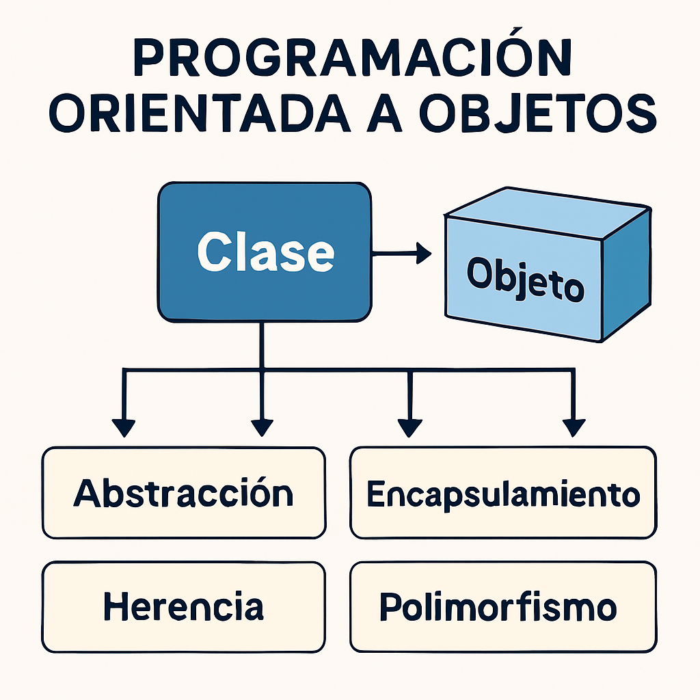
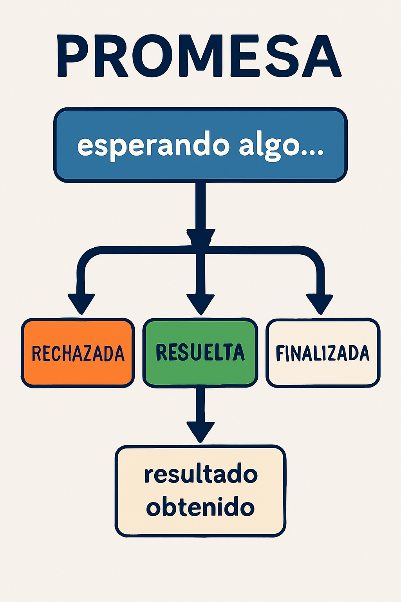
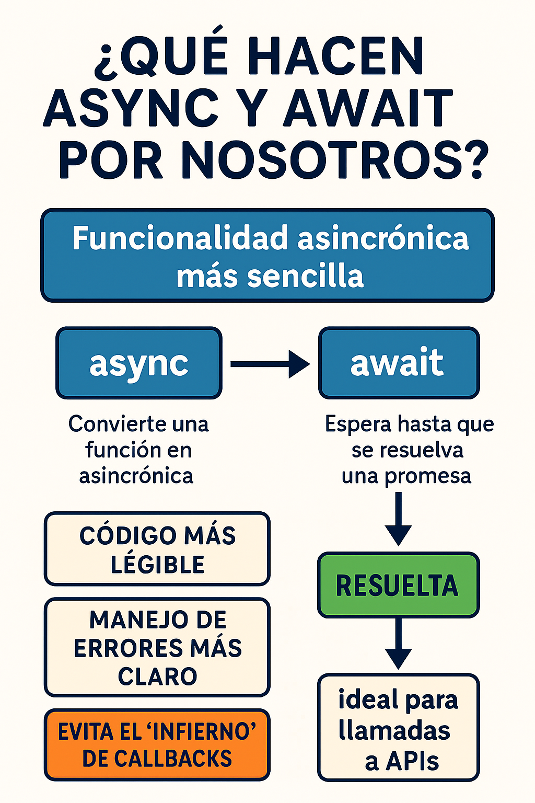

# <u>Check-Point 8</u>

## 📑 Índice

1. Bucles en JavaScript 
2. Diferencias entre `const`, `let` y `var`
3. Funciones de flecha
4. desestructuración de variables
5. Operador de extensión (spread)
6. Programación orientada a objetos (POO)
7. Promesas en JavaScript
8. `async` y `await`
9. 

---

### <mark>Bucles en JavaScript</mark>

Una de las principales ventajas de la programación es la posibilidad de crear **bucles y repeticiones** para tareas específicas, y que no tengamos que realizar el mismo código varias veces de forma manual

Los bucles permiten repetir un bloque de código varias veces hasta que se cumple una condición.

Existen muchas formas de realizar bucles:

| TIPO DE BUCLE | DESCRIPCION                                                               |
| ------------- | ------------------------------------------------------------------------- |
| `for`         | El bucle clasico y mas utilizado                                          |
| `while`       | Para bucles simples                                                       |
| `do...while`  | Para bucles simples, que necesitan que el bucle se realice minimo una vez |
| `for...in`    | Bucle sobre las posiciones de un array                                    |
| `for...of`    | Bucle sobre los elementos de un array                                     |

### 1. 🔍 `for`

El bucle **for** es quizás uno de los más utilizados en el mundo de la programación. Sintaxis básica y casos de uso:

```js
// for (inicio; condicion; incremento) {bucle}
// En este caso mientras i sea menor que 5 se ejecutara el bucle
for (let i = 0; i < 5; i++) {
  console.log(i);
}
```

- Se utiliza cuando sabemos de antemano cuántas iteraciones necesitamos.  
- Ideal para recorrer arrays por índice¡  



### 

### 2. 🔍 `while`

El bucle **while** es uno de los bucles más simples que podemos crear

No necesita especificamente un contador, puede ser cualquier otro tipo de condicional  p.ej --> `while (true)` ¡¡

Repite el bucle mientras la condición sea verdadera:

```js
// En este caso, al igual que el anterior mientras contador sea menor que 
// 5 se ejecuta el bucle
let contador = 0;
while (contador < 5) {
  console.log(contador);
  contador++;
}
```

- Útil cuando no conocemos el número de iteraciones de antemano.  
- Cuando queremos utilizar condiciones no numericas
- Hay que controlar bien la variable de condición para evitar bucles infinitos.  



### 

### 3.  🔍`do...while`

El funcionamiento es el mismo que el bucle while, con una unica y gran diferencia.

La condicion se comprueba despues de ejecutar el bucle, en vez de antes, lo cual

**garantiza al menos una ejecución** antes de evaluar la condición:

```js
// El bucle se ejecuta una primera vez, y despues se repite siempre que
// el numero introducido sea mayor o igual a 10
let num;
do {
  num = prompt("Ingresa un número mayor que 10:");
} while (num <= 10);
```

- Se usa cuando se requiere que el bloque se ejecute al menos una vez, aunque la condicion no se cumpla

- Se usa esècialmente en :
  
  - Validacion de entradas de usuarios
  - Repeticion de procesos que pueden llevar varios intentos (establecer conexiones)
  - Videojuegos
  - Paginacion de datos devueltos por APIs
  - Calculo de funciones.
  
  

### 

### 4. 🔍 `for `...` in`

El bucle for...in en JavaScript es una **forma de recorrer las propiedades de un objeto o los índices de un array**, ejecutando un bloque de código para cada propiedad o índice. 

En esencia, te permite "entrar" en el objeto o array y **acceder a cada uno de sus elementos de manera secuencial,** sin necesidad de conocer sus nombres o posiciones exactas de antemano

```js
const persona = {
  nombre: "Israel",
  edad: 30,
  ciudad: "Irun",
};

for (let propiedad in persona) {
  console.log(propiedad + ": " + persona[propiedad]);
}
```

En este ejemplo, el bucle `for...in` recorrerá las propiedades `nombre`, `edad` y `ciudad` del objeto `persona`. En cada iteración, la variable `propiedad` contendrá el nombre de la propiedad actual, y `persona[propiedad]` accederá al valor de esa propiedad. El resultado en la consola será:

```js
nombre: Israel
edad: 30  
ciudad: Irun
```



### 

### 4. 🔍 `for` ... `of`

Es una** forma sencilla de recorrer los elementos de un objeto iterable**, como un array, string o un conjunto, **sin necesidad de preocuparse por índices**. Casi nada¡¡

Funciona obteniendo cada valor del objeto iterable y asignándolo a una variable, luego ejecuta el código dentro del bucle con ese valor.

```js
const frutas = ["manzana", "banana", "naranja"];

for (const fruta of frutas) {
  console.log(fruta);
} 
```



---

## <mark>Diferencias entre `const`, `let` y `var`</mark>

En JavaScript, `var`, `let` y `const` son palabras clave utilizadas para declarar variables, pero tienen diferencias importantes en cuanto a su alcance (scope) y comportamiento. `var` es la forma tradicional de declarar variables y tiene alcance de función o global. `let` y `const` fueron introducidos en [ECMAScript 6](ES6) y tienen alcance de bloque. `let` permite reasignar el valor de la variable, mientras que `const` se utiliza para declarar constantes cuyo valor no puede cambiar después de su inicialización.

Resumen:

| Característica       | var                      | let                         | const                       |
| -------------------- | ------------------------ | --------------------------- | --------------------------- |
| Ámbito (scope)       | Global o de función      | Bloque `{}`                 | Bloque `{}`                 |
| Reasignación         | Permitida                | Permitida                   | No permitida                |
| Hoisting (elevación) | Sí (valor `undefined`)   | Sí (temporal dead zone)     | Sí (temporal dead zone)     |
| Redeclaración        | Permitida en mismo scope | No permitida en mismo scope | No permitida en mismo scope |

- `var` puede llevar a confusiones por su scope amplio y hoisting con valor `undefined`.  
- `let` es la opción recomendada para variables que cambian.  
- `const` sirve para constantes o referencias que no cambian.  

<u>Vamos a verlas una por una:</u>   

`var `:
**Alcance**:  De función o global. Si se declara dentro de una función, su alcance es la función. Si se declara fuera de una función, es global y accesible desde cualquier parte del código.
**Reasignación**:  Permite reasignar el valor de la variable.
**Redeclaración**: Permite redeclarar la variable dentro de su alcance.
**Hoisting**: Las declaraciones var son elevadas a la parte superior de su ámbito, pero se inicializan con undefined. Esto significa que puedes acceder a la variable antes de su declaración, pero obtendrás undefined como valor.

```js
// Ejemplo de var
function ejemploVar() {
  var x = 10;
  if (true) {
    var x = 20; // Reasigna la misma variable 'x'
    console.log(x); // Imprime 20
  }
  console.log(x); // Imprime 20 (mismo valor que dentro del if)
}
ejemploVar();
```

`let` :
**Alcance**: De bloque. Su alcance está limitado al bloque de código en el que se declara (por ejemplo, dentro de una estructura if o un bucle).
**Reasignación**: Permite reasignar el valor de la variable.
**Redeclaración**: No permite redeclarar la variable dentro del mismo bloque.
**Hoisting**: Las declaraciones let también son elevadas, pero no se inicializan, lo que provoca un error si se intenta acceder a la variable antes de su declaración. 

```js
// Ejemplo de let
function ejemploLet() {
  let y = 10;
  if (true) {
    let y = 20; // Declara una nueva variable 'y' dentro del bloque if
    console.log(y); // Imprime 20
  }
  console.log(y); // Imprime 10 (valor de la variable 'y' fuera del if)
}
ejemploLet();
```

`const`:
**Alcance**: De bloque, igual que let.
**Reasignación**: No permite reasignar el valor de la variable después de su inicialización.
**Redeclaración**: No permite redeclarar la variable dentro del mismo bloque.
**Hoisting**: Similar a let, las declaraciones const son elevadas pero no se inicializan, resultando en un error si se intenta acceder a la variable antes de su declaración.
Inicialización: Es obligatorio inicializar una variable const al momento de declararla.

```js
// Ejemplo de const
const pi = 3.14159;
// pi = 3.14; // Esto generaría un error porque no se puede reasignar a 'pi'
const persona = { nombre: "Juan", edad: 30 };
// Se pueden modificar las propiedades de un objeto const
persona.edad = 31; 
console.log(persona.edad); // Imprime 31
// persona = { nombre: "Pedro", edad: 25 }; // Esto generaría un error, no se puede reasignar el objeto completo
```

---

## <mark>Funciones de flecha</mark>

Las funciones flecha (arrow functions) en JavaScript son una **forma más corta y concisa de escribir funciones**. Se caracterizan por usar la sintaxis `=>` (de ahí su nombre) para separar los argumentos de la función de su cuerpo. Son útiles para funciones simples y, especialmente, para funciones que se pasan como argumentos a otras funciones (callbacks).

Las funciones de flecha ofrecen una sintaxis más concisa y no tienen su propio `this`.

```js
// Funcion Tradicional
function suma(a, b) {
  return a + b;
}

// Funcion Flecha 
const sumaFlecha = (a, b) => a + b;
```

- Se eliminan las palabras clave `function` y `return` en funciones de una sola línea.  
- No rebindean `this`, útil en callbacks y métodos de clase.  

<table style="border-collapse: collapse; width: 100%;">
  <thead>
    <tr style="background-color: #f2a154; color: white;">
      <th style="padding: 8px; border: 1px solid #ddd;">Forma</th>
      <th style="padding: 8px; border: 1px solid #ddd;">Ejemplo</th>
      <th style="padding: 8px; border: 1px solid #ddd;">Notas</th>
    </tr>
  </thead>
  <tbody>
    <tr style="background-color: #fff3e0;">
      <td style="padding: 8px; border: 1px solid #ddd;">Sin parámetros</td>
      <td style="padding: 8px; border: 1px solid #ddd;"><code>() => 42</code></td>
      <td style="padding: 8px; border: 1px solid #ddd;">Se usan paréntesis vacíos</td>
    </tr>
    <tr style="background-color: #ffe0b2;">
      <td style="padding: 8px; border: 1px solid #ddd;">Un parámetro</td>
      <td style="padding: 8px; border: 1px solid #ddd;"><code>x => x * 2</code></td>
      <td style="padding: 8px; border: 1px solid #ddd;">Paréntesis opcionales</td>
    </tr>
    <tr style="background-color: #fff3e0;">
      <td style="padding: 8px; border: 1px solid #ddd;">Múltiples parámetros</td>
      <td style="padding: 8px; border: 1px solid #ddd;"><code>(x, y) => x + y</code></td>
      <td style="padding: 8px; border: 1px solid #ddd;">Paréntesis obligatorios</td>
    </tr>
    <tr style="background-color: #ffe0b2;">
      <td style="padding: 8px; border: 1px solid #ddd;">Cuerpo con varias líneas</td>
      <td style="padding: 8px; border: 1px solid #ddd;"><code>(x) => { let y = x * 2; return y; }</code></td>
      <td style="padding: 8px; border: 1px solid #ddd;">Se usan llaves y <code>return</code> explícito</td>
    </tr>
  </tbody>
</table>

<u>Situaciones de uso:</u>

- **Funciones de una sola línea:** Cuando la función solo realiza una operación, se puede usar la sintaxis de retorno implícito para hacerla más compacta:

```js
    const suma = (a, b) => a + b;
```

- **Callbacks (funciones como argumentos):** Las funciones flecha son ideales para usarse como argumentos en otras funciones, como en map, filter, forEach, etc.: 

```js
    const numeros = [1, 2, 3, 4, 5];
    const cuadrados = numeros.map(x => x * x); // [1, 4, 9, 16, 25]
```

- **Funciones con múltiples líneas:** Si la función necesita más de una línea, se usan llaves {} y la palabra clave return (igual que en las funciones tradicionales): 

```js
    const procesar = (a, b) => {
      let resultado = a + b;
      resultado = resultado * 2;
      return resultado;
    };
```

- **Funciones sin argumentos:** Se usan paréntesis vacíos () para indicar que la función no recibe argumentos: 

```js
    const saludar = () => console.log("Hola!");
```

- **Funciones con un solo argumento:** Se puede omitir los paréntesis si solo hay un argumento: 

```js
    const saludarPersona = nombre => console.log(`Hola mundo`);
```

Diferencias clave con funciones tradicionales:

- `this`:
  
  Las funciones flecha **no tienen su propio** `this`. El **valor** de `this` dentro de una función flecha es el mismo que fuera de ella (**el contexto léxico**). Esto puede ser útil en ciertos casos para evitar problemas con el valor de `this`.

- `arguments`:
  
  Tampoco tienen su propio objeto `arguments`. Si necesitas acceder a los argumentos, debes usar parámetros nombrados o el operador de resto `...` (spread).

---

## 

## <mark>Desestructuración de  variables</mark>

La **desestructuración de variables** en JavaScript es una de esas joyas del lenguaje que, cuando la entiendes bien, te hace escribir código más limpio, más legible y más potente.

La desestructuraciónen JavaScript es una funcionalidad que **permite extraer datos de estructuras de datos como arrays y objetos y asignarlos a variables individuales de forma más concisa y legible.** En lugar de acceder a los elementos de una estructura uno por uno usando índices o notación de puntos, la desestructuración facilita la extracción de múltiples valores simultáneamente. 

Desestructuración de objetos:

La desestructuración de objetos permite extraer propiedades de un objeto y asignarlas a variables con el mismo nombre o con nombres diferentes utilizando un alias.

### Array :

```js
const colores = ["rojo", "verde", "azul"];
const [primero, segundo] = colores;
console.log(primero);  // "rojo"
console.log(segundo);  // "verde","azul"
```

### Objetos :

```js
const usuario = { nombre: "Ana", edad: 28 };
const { nombre, edad } = usuario;
console.log(edad);  // 28
```

<u>Beneficios de la desestructuración:</u>

- **Legibilidad:**
  
  Hace el código más claro y fácil de entender al reducir la necesidad de acceder a propiedades o elementos de estructuras de datos de forma repetitiva.

- **Concisión:**
  
  Permite extraer múltiples valores en una sola línea, lo que puede reducir la cantidad de código.

- **Flexibilidad:**
  
  Permite asignar nombres diferentes a las variables extraídas de las propiedades de un objeto, utilizando aliases.

- **Facilita la escritura de funciones:**
  
  Facilita la extracción de argumentos de un objeto o array dentro de una función.
  
   

<u>Casos de uso comunes:</u>

- **Extracción de propiedades de objetos de respuesta de APIs:**
  
  Cuando se reciben datos de una API, la desestructuración permite extraer solo las propiedades necesarias de manera concisa.

- **Simplificación de la lógica de funciones:**
  
  La desestructuración puede simplificar la lógica de las funciones al permitir extraer los parámetros necesarios de un objeto o array directamente en la firma de la función.

- **Manipulación de datos de array:**
  
  La desestructuración facilita la extracción de elementos específicos de un array para su manipulación o procesamiento.

<u>**Trucos:**</u>

Trucos que no te cuentan en todas partes...

🔄 **Intercambiar valores sin variable temporal**

```js
let a = 1, b = 2;
[a, b] = [b, a];
```

➡️ ¡Magia! `a` ahora es `2`, `b` es `1`.

🧱 **Ignorar elementos que no te interesan**

```js
const [ , segundoColor ] = colores;
```

➡️ Ignoras el primero, te quedas con el segundo.

🧬 **Desestructuración anidada**

```js
const persona = { nombre: "Luis", direccion: { ciudad: "Bilbao", cp: 48001 } };
const { direccion: { ciudad } } = persona;
```

➡️ Extraes `ciudad` directamente, sin pasar por `direccion`.

🧪 **En combinación con `map`, `filter`, etc.**

```js
usuarios.map(({ nombre }) => console.log(nombre));
```

➡️ Extraes solo lo que necesitas dentro de funciones de array.

---

## 

## <mark> Operador de extensión (spread)</mark>

 El operador `...` en JavaScript se llama **spread operator** (operador de extensión) y también se usa como **rest operator** (operador de resto), dependiendo del contexto.

Aunque parecen iguales (`...`), **su función cambia según dónde lo pongas**.

## 🌀 1. Spread Operator (Extensión)

### ✅ ¿Qué hace?

**"Extiende"** los elementos de un array u objeto. Es como abrir una caja y sacar todo lo que hay dentro.

### 🔧 Ejemplos con Arrays

```js
const frutas = ["manzana", "pera"];
const masFrutas = [...frutas, "plátano", "kiwi"];
console.log(masFrutas); // ["manzana", "pera", "plátano", "kiwi"]
```

➡️ Copias el array `frutas` y le añades más elementos.

### 🔧 Ejemplos con Objetos

```js
const usuario = { nombre: "Ana", edad: 28 };
const usuarioConCiudad = { ...usuario, ciudad: "Madrid" };
console.log(usuarioConCiudad);
// { nombre: "Ana", edad: 28, ciudad: "Madrid" }
```

➡️ Copias el objeto `usuario` y le añades/modificas propiedades.

### 🔧 Clonar arrays u objetos

```js
const copiaArray = [...originalArray];
const copiaObjeto = { ...originalObjeto };
```

➡️ Muy útil para evitar modificar el original (evitar mutaciones).

### 🔧 Combinar múltiples arrays

```js
const a = [1, 2];
const b = [3, 4];
const combinado = [...a, ...b]; // [1, 2, 3, 4]
```

### 🔧 Combinar múltiples objetos

```js
const datos1 = { nombre: "Luis" };
const datos2 = { edad: 35 };
const perfil = { ...datos1, ...datos2 }; // { nombre: "Luis", edad: 35 }
```

## 🧹 2. Rest Operator (Resto)

### ✅ ¿Qué hace?

**"Agrupa"** el resto de elementos en una variable. Es como decir:

> “Dame lo que queda después de extraer lo que me interesa.”

### 🔧 En desestructuración de arrays

```js
const [primero, ...resto] = [10, 20, 30, 40];
console.log(primero); // 10
console.log(resto);   // [20, 30, 40]
```

### 🔧 En desestructuración de objetos

```js
const { nombre, ...otrosDatos } = { nombre: "Ana", edad: 28, ciudad: "Madrid" };
console.log(nombre);      // "Ana"
console.log(otrosDatos);  // { edad: 28, ciudad: "Madrid" }
```

### 🔧 En funciones con número variable de argumentos

```js
function sumar(...numeros) {
  return numeros.reduce((acc, n) => acc + n, 0);
}

sumar(1, 2, 3, 4); // 10
```

➡️ `...numeros` captura todos los argumentos como un array.

## 🧠 Casos Reales Útiles

| Caso                  | Uso del operador `...`                                       |
| --------------------- | ------------------------------------------------------------ |
| Clonar arrays/objetos | Evitar mutaciones accidentales                               |
| Combinar datos        | Fusionar múltiples arrays u objetos                          |
| Extraer lo importante | Usar `rest` para ignorar lo que no necesitas                 |
| Funciones flexibles   | Capturar argumentos sin usar `arguments`                     |
| React props           | `<Componente {...props} />` para pasar todas las propiedades |

## 🧙‍♂️ Trucos y Consejos

- Puedes usar `...` en arrays y objetos, pero **no puedes extender objetos dentro de arrays directamente** (¡ojo con eso!).

- En objetos, si hay propiedades repetidas, **la última sobrescribe**:
  
  ```js
  const obj = { a: 1, a: 2 }; // a será 2
  ```

- En funciones, usar `...args` es más limpio que `arguments`.

---

## 

## <mark> Programación orientada a objetos (POO)</mark>

 La **Programación Orientada a Objetos** es un estilo de programación que organiza el código en torno a **objetos**, que son como **mini programas** que tienen:

- **Propiedades** (datos)
- **Métodos** (funciones que hacen cosas)

La idea es **modelar cosas del mundo real** (como usuarios, autos, productos) en forma de objetos que interactúan entre sí.



## 

## 🧱 Conceptos clave del paradigma de POO:

| Concepto            | Explicación sencilla                                            | Ejemplo                                              |
| ------------------- | --------------------------------------------------------------- | ---------------------------------------------------- |
| **Objeto**          | Una agrupación de datos y funciones                             | `{ nombre: "Ana", saludar() { ... } }`               |
| **Clase**           | Una plantilla para crear objetos                                | `class Usuario { ... }`                              |
| **Instancia**       | Un objeto creado a partir de una clase                          | `const u = new Usuario()`                            |
| **Encapsulamiento** | Ocultar detalles internos                                       | Usar métodos en vez de acceder directo a propiedades |
| **Herencia**        | Reutilizar código de otra clase                                 | `class Admin extends Usuario`                        |
| **Polimorfismo**    | Diferentes clases pueden usar el mismo método de forma distinta | `saludar()` se comporta diferente en cada clase      |

## 🧪 Ejemplo básico:

```js
class Animal {
  constructor(nombre) {
    this.nombre = nombre;
  }

  hablar() {
    console.log(`${this.nombre} hace un sonido`);
  }
}

class Perro extends Animal {
  hablar() {
    console.log(`${this.nombre} dice: ¡Guau!`);
  }
}

const miPerro = new Perro("Firulais");
miPerro.hablar(); // Firulais dice: ¡Guau!
```

➡️ `Perro` hereda de `Animal`, pero redefine el método `hablar`.

## 🎯 ¿Para qué sirve la POO?

- **Organizar mejor el código**: Cada objeto tiene su propia lógica.
- **Reutilizar código**: Herencia y clases evitan repetir.
- **Facilitar mantenimiento**: Cambios en una clase no rompen todo.
- **Modelar el mundo real**: Ideal para apps con usuarios, productos, etc.

## 

## 🛠️ Casos reales de uso

| Caso                | Cómo ayuda la POO                              |
| ------------------- | ---------------------------------------------- |
| Aplicaciones web    | Modelar usuarios, productos, pedidos           |
| Juegos              | Crear personajes, enemigos, armas como objetos |
| Interfaces gráficas | Botones, ventanas, formularios como clases     |
| APIs                | Modelar recursos y operaciones como objetos    |

## 

## 🧙‍♂️ Trucos y buenas prácticas

- Usa `constructor` para inicializar datos.

- Métodos deben actuar sobre `this`, que representa la instancia.

- Usa `extends` para heredar y `super()` para llamar al constructor padre.

- Puedes combinar POO con otros estilos (como programación funcional).

- En JavaScript moderno, puedes usar **clases privadas** con `#`:
  
  ```js
  class Cuenta {
    #saldo = 0;
    depositar(monto) {
      this.#saldo += monto;
    }
  }
  ```

## 

## 🧩 ¿Y si no uso clases?

JavaScript permite usar objetos sin clases:

```js
const usuario = {
  nombre: "Ana",
  saludar() {
    console.log(`Hola, soy ${this.nombre}`);
  }
};
```

➡️ Esto también es POO, aunque más informal. Ideal para cosas simples.

---

## 

## <mark> Promesas en JavaScript</mark>

Una **promesa** es un objeto que representa **una operación asincrónica** que **aún no ha terminado**, pero que lo hará en el futuro.  
Es como decirle a JavaScript:

> “Estoy esperando algo (como una respuesta del servidor), y te aviso cuando esté listo.”

## 🧠 Estados de una Promesa

| Estado      | Significado                |
| ----------- | -------------------------- |
| `pending`   | La promesa está en proceso |
| `fulfilled` | Se resolvió con éxito      |
| `rejected`  | Falló por algún motivo     |

## 

## 🛠️ Crear una Promesa

```js
const promesa = new Promise((resolve, reject) => {
  const exito = true;
  if (exito) {
    resolve("¡Todo bien!");
  } else {
    reject("Algo salió mal");
  }
});
```

## 🔧 Usar una Promesa

```js
promesa
  .then(resultado => console.log(resultado))   // Si se resuelve
  .catch(error => console.error(error))       // Si falla
  .finally(() => console.log("Terminado"));   // Siempre se ejecuta
```

## 🧪 Ejemplo real: Simular una API

```js
function obtenerUsuario() {
  return new Promise((resolve) => {
    setTimeout(() => {
      resolve({ nombre: "Ana", edad: 30 });
    }, 1000);
  });
}

obtenerUsuario().then(usuario => {
  console.log(usuario.nombre); // "Ana"
});
```

➡️ `setTimeout` simula una espera como si fuera una llamada a una API.

## 🚀 Promesas con `async/await`

```js
async function mostrarUsuario() {
  try {
    const usuario = await obtenerUsuario();
    console.log(usuario.nombre);
  } catch (error) {
    console.error("Error:", error);
  }
}
```

➡️ `await` pausa la función hasta que la promesa se resuelva.  
Más limpio que usar `.then()` y `.catch()`.

## 🎯 ¿Para qué sirven las promesas?

- Llamadas a APIs (fetch, axios)
- Operaciones con archivos (Node.js)
- Timers y delays
- Cargas de datos en apps web
- Procesos que tardan (como animaciones o cálculos)

## 🧙‍♂️ Trucos y buenas prácticas

- ✅ Usa `async/await` para código más legible.

- ✅ Siempre maneja errores con `try/catch` o `.catch()`.

- ✅ Encadena promesas si necesitas ejecutar varias en orden.

- ✅ Usa `Promise.all()` para ejecutar varias promesas en paralelo:
  
  ```js
  Promise.all([promesa1, promesa2]).then(([res1, res2]) => { ... });
  ```

## ⚠️ Errores comunes

| Error                                                | Cómo evitarlo                                       |
| ---------------------------------------------------- | --------------------------------------------------- |
| Olvidar `return` en funciones que devuelven promesas | Asegúrate de devolver la promesa                    |
| No manejar errores                                   | Siempre usa `.catch()` o `try/catch`                |
| Mezclar `then` con `await`                           | Usa uno u otro, no los combines                     |
| Usar `await` fuera de funciones `async`              | Solo puedes usar `await` dentro de `async function` |

## 📌 Resumen:

```js
// Crear
const promesa = new Promise((res, rej) => { ... });

// Usar con then/catch
promesa.then(...).catch(...);

// Usar con async/await
async function miFuncion() {
  try {
    const resultado = await promesa;
  } catch (e) {
    console.error(e);
  }
}
```

---

## <mark> async y await</mark>

Sintaxis que simplifica el manejo de promesas como si fuesen código sincrónico.

`async` y `await` son dos palabras mágicas que **simplifican el trabajo con promesas**.  
Nos permiten escribir **código asincrónico** que parece **sincrónico**, lo que lo hace más fácil de leer, escribir y mantener.

## 🧠 ¿Qué significa "asincrónico"?

Es cuando el código **no se ejecuta en orden inmediato**, sino que **espera** a que algo termine (como una llamada a una API, una lectura de archivo, etc.) sin bloquear el resto del programa.

## 🔧 ¿Qué hace `async`?

- Convierte una función en **asincrónica**.
- Hace que esa función **devuelva una promesa automáticamente**.

```js
async function saludar() {
  return "Hola";
}

saludar().then(msg => console.log(msg)); // "Hola"
```

## 🔧 ¿Qué hace `await`?

- **Pausa** la ejecución de la función hasta que la promesa se resuelva.
- Solo se puede usar **dentro de una función `async`**.

```js
async function obtenerDatos() {
  const respuesta = await fetch("https://api.com/datos");
  const datos = await respuesta.json();
  console.log(datos);
}
```

➡️ Parece código secuencial, pero está esperando sin bloquear.

## 🧪 Ejemplo real: sin `await` vs con `await`

### ❌ Con `.then()` (más difícil de leer)

```js
fetch("https://api.com")
  .then(res => res.json())
  .then(data => console.log(data))
  .catch(err => console.error(err));
```

### ✅ Con `async/await` (más limpio)

```js
async function cargarDatos() {
  try {
    const res = await fetch("https://api.com");
    const data = await res.json();
    console.log(data);
  } catch (err) {
    console.error("Error:", err);
  }
}
```

## 

## 🎯 ¿Qué nos aportan realmente?

| Beneficio                         | ¿Por qué importa?                           |
| --------------------------------- | ------------------------------------------- |
| Código más legible                | Parece secuencial, fácil de seguir          |
| Manejo de errores más claro       | `try/catch` es más intuitivo que `.catch()` |
| Evita el "callback hell"          | No se anidan funciones infinitamente        |
| Ideal para APIs y procesos lentos | Espera sin bloquear el resto del programa   |

## 

## 🧙‍♂️ Trucos y buenas prácticas

- ✅ Siempre usa `try/catch` para manejar errores con `await`.

- ✅ Puedes usar `await` con cualquier función que devuelva una promesa.

- ✅ Usa `Promise.all()` con `await` para ejecutar varias promesas en paralelo:
  
  ```js
  const [a, b] = await Promise.all([promesa1, promesa2]);
  ```

- ✅ Puedes usar funciones `async` dentro de `.map()` si devuelven promesas.

## ⚠️ Errores comunes

| Error                                       | Cómo evitarlo                                  |
| ------------------------------------------- | ---------------------------------------------- |
| Usar `await` fuera de una función `async`   | Solo funciona dentro de `async function`       |
| Olvidar `try/catch`                         | Puede romper tu app si hay errores             |
| Mezclar `.then()` con `await` sin necesidad | Elige uno u otro para mantener claridad        |
| No esperar correctamente                    | Asegúrate de que lo que esperas es una promesa |

## 📌 Resumen :



```js
// Función async
async function miFuncion() {
  try {
    const resultado = await algunaPromesa();
    console.log(resultado);
  } catch (error) {
    console.error(error);
  }
}
```

---

### Enlaces que pueden interesarte:

## 📚 Enlaces útiles para aprender JavaScript en español

### 🧠 Tutoriales y documentación

- [El Tutorial de JavaScript Moderno (javascript.info)](https://es.javascript.info/)  
  Curso completo desde cero hasta avanzado, con explicaciones claras y ejemplos prácticos.

- [Lenguaje JS - Manz.dev](https://lenguajejs.com/)  
  Guía extensa sobre JavaScript, DOM, eventos, asincronía, frameworks y más.

### 🛠️ Repositorios y recursos comunitarios

- [Lista impresionante para aprender JavaScript en español (GitHub)](https://github.com/rosepac/aprender-javascript-en-espanol)  
  Recopilación de cursos, chuletas, videotutoriales y recursos interactivos.

### 🎥 Videotutoriales recomendados

- [Curso JavaScript desde cero (YouTube - Píldoras Informáticas)](https://www.youtube.com/playlist?list=PLU8oAlHdN5BnXAXQ5e0sWfUdUgi7PjzDl)  
  Más de 70 vídeos cortos para aprender paso a paso.

- [JavaScript para principiantes (Fazt Code)](https://www.youtube.com/watch?v=z95mZVUcJ-E)  
  Curso intensivo en una sola sesión, ideal para repasar o empezar.

### 🧪 Práctica y ejercicios

- [Retos diarios en LenguajeJS](https://lenguajejs.com/challenges/)  
  Ejercicios prácticos para mejorar tus habilidades con HTML, CSS y JS.

- [Codewars (en español disponible)](https://www.codewars.com/)  
  Plataforma para resolver desafíos de programación con JavaScript.

--- 

 $Israel 2025
